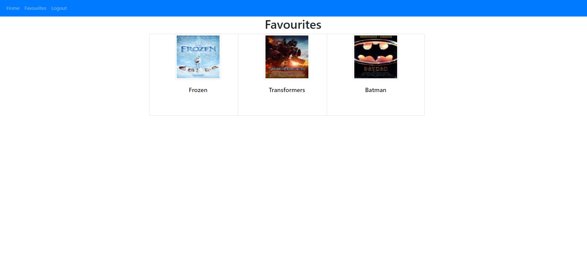

# Favourite Movies Web App
This is a full-stack app I made with Flask, SQLAlchemy, and bootstrap. Users can register for an account and log in. It uses the OMDb api to allow users to search and favourite movies. Favourited movies are related to the user in the database and are only visible to them.

