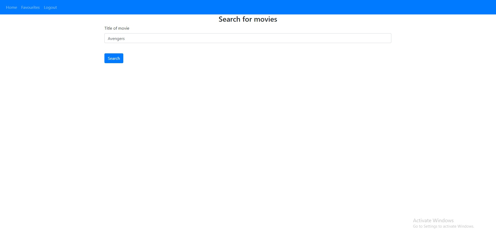
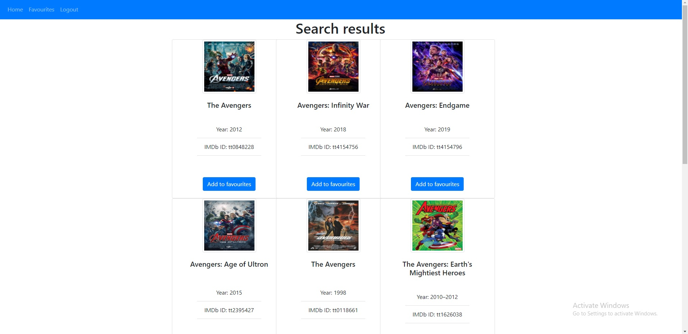

# Favourite Movies Web App
## About
This is a web app that allow users to search for movie information and save them to their favourites page. Users can sign up, login, search for movies, and save them to their account.

## Preview

## Technologies
- Flask
- SQLAlchemy
- Jinja
- Bootstrap
- OMDb API
## Description
This application consists of Flask REST APIs for authentication and CRUD operations. The templating engine Jinja is used to render the UI components and data. A third-party API (OMDb API) is integrated for users to query via a form field and receive movie data. The movie data is rendered in a grid with a save button for each movie which saves the movie to the user account. 
